# Lab 4 : Opérations CRUD avancées

## Objectif
Manipuler les données avec `INSERT`, `UPDATE`, `DELETE` et sécuriser les opérations grâce aux transactions.

## Concepts
- CRUD : INSERT / UPDATE / DELETE
- Contraintes : PK, FK, CASCADE, RESTRICT
- Transactions : START TRANSACTION, COMMIT, ROLLBAC

#### Résultat visuel

##  INSERT : création de nouveaux enregistrements

 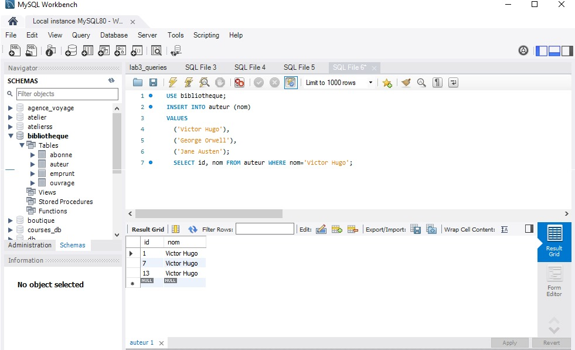 
<em>Figure 1</em>
 

 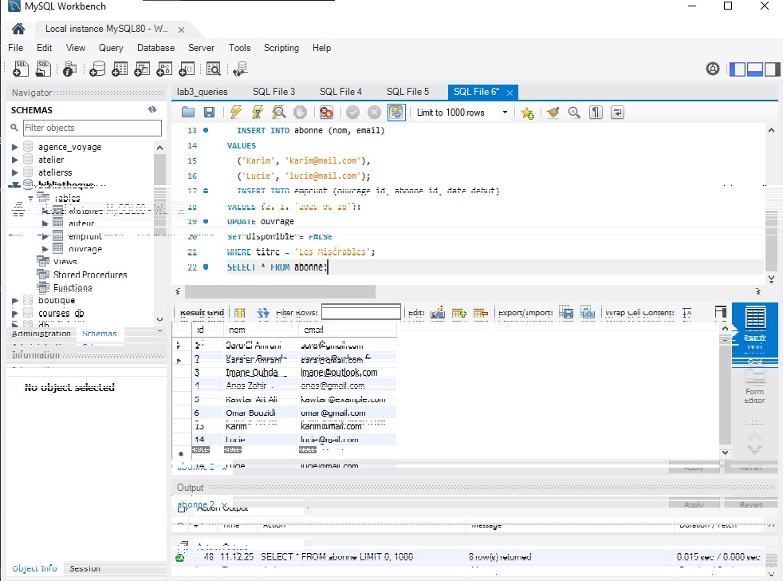 
<em>Figure 2</em>
 

## UPDATE : modification des données

 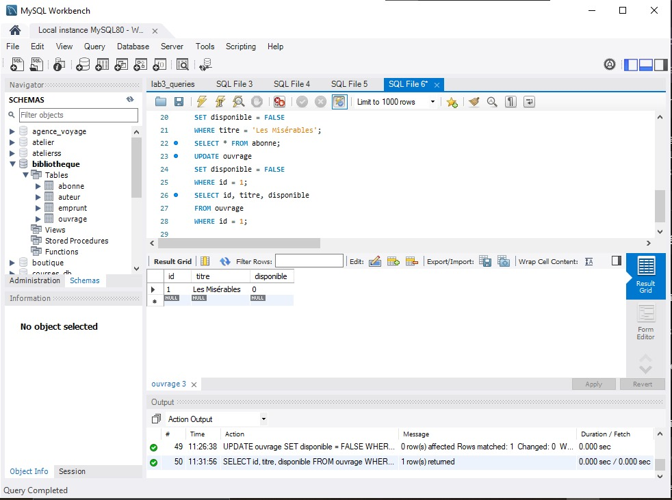 
<em>Figure 3</em>
 

 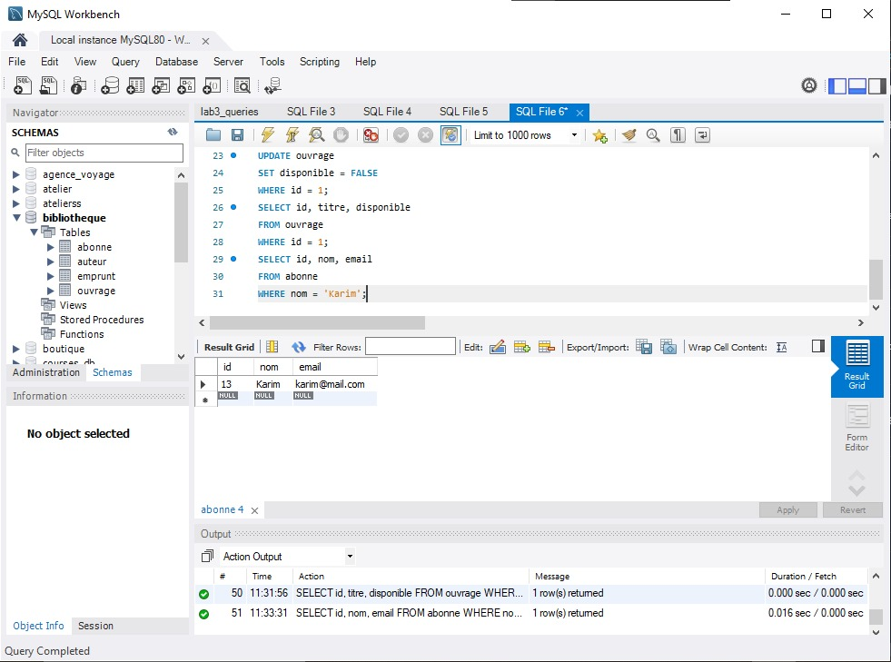 
<em>Figure 4</em>
 

 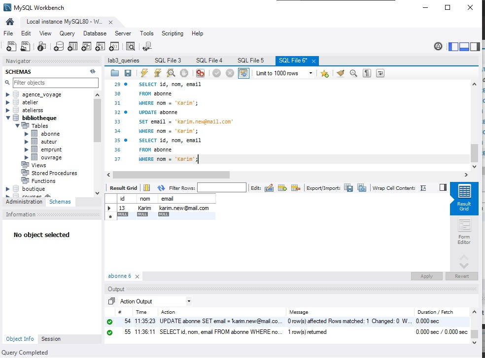 
<em>Figure 5</em>
 

 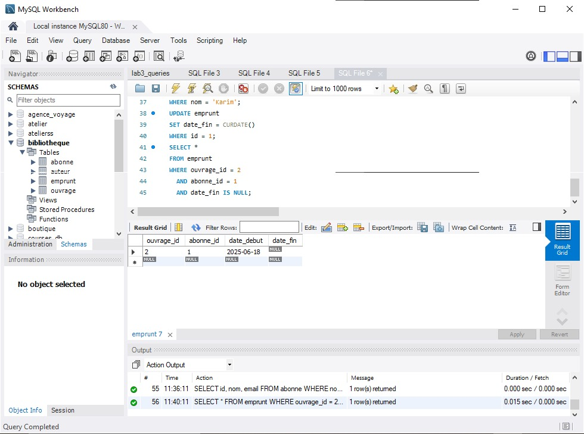 
<em>Figure 6</em>
 

 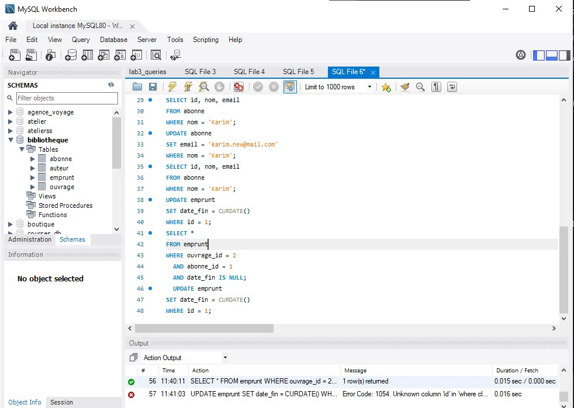 
<em>Figure 7</em>
 

##  DELETE : suppression des enregistrements

 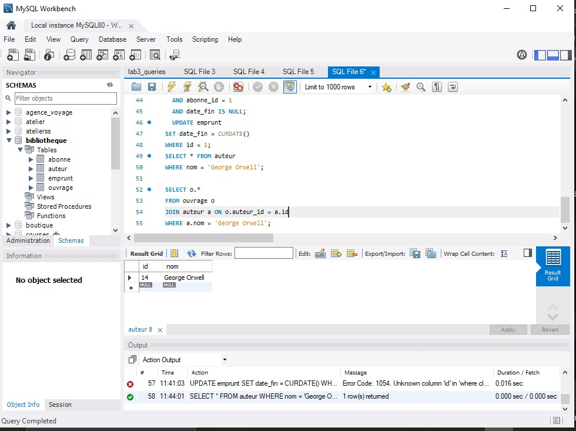 
<em>Figure 8</em>
 

 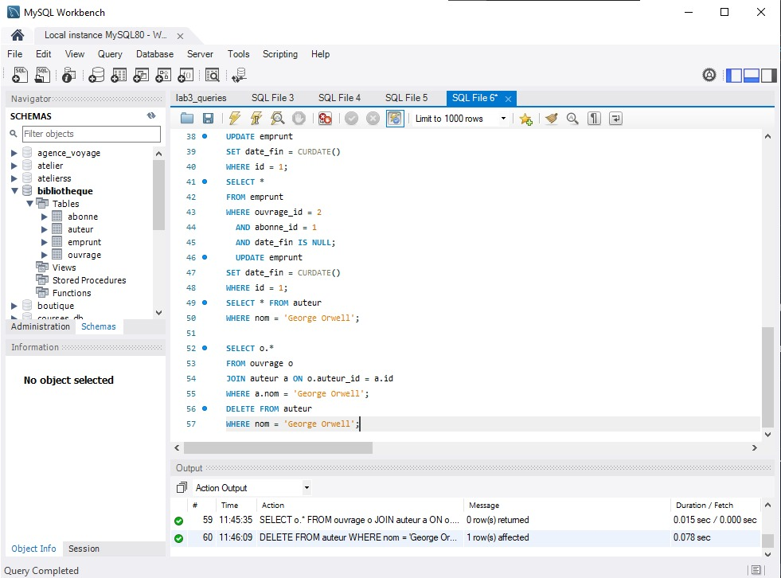 
<em>Figure 9</em>
 

 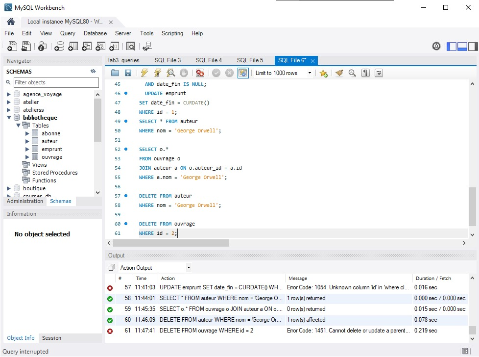 
<em>Figure 10</em>
 

 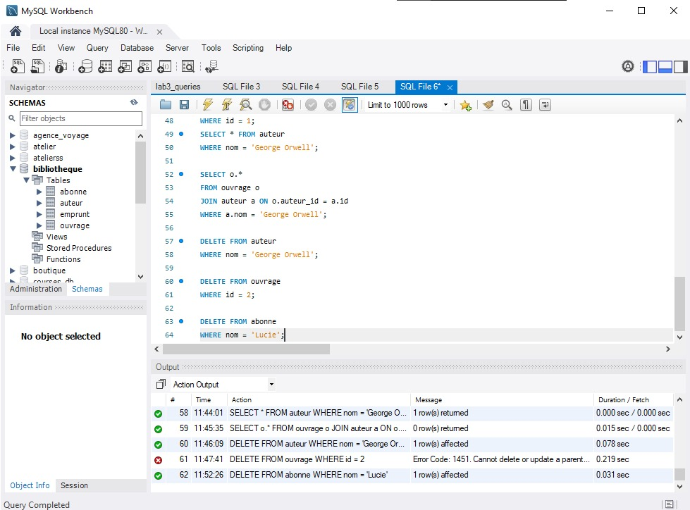 
<em>Figure 11</em>
 

## Transactions : grouper plusieurs opérations atomiquement

 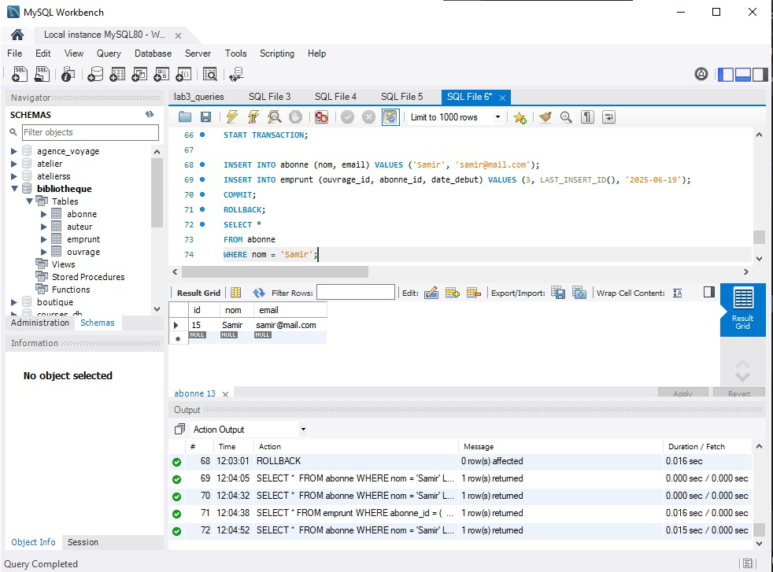 
<em>Figure 12</em>
 

 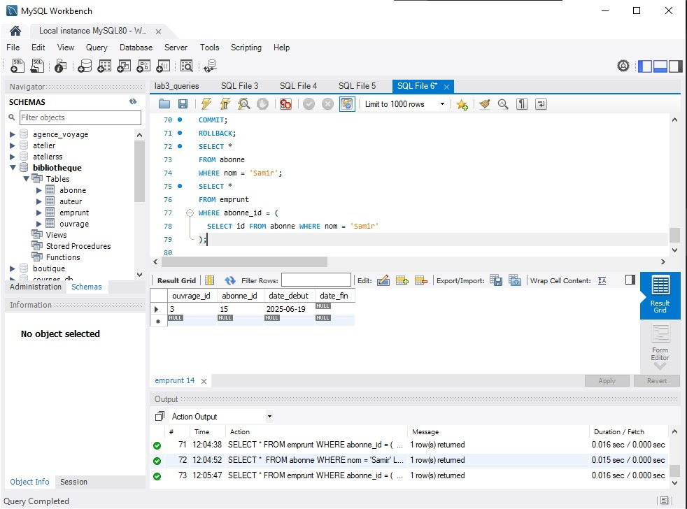 
<em>Figure 13</em>
 

